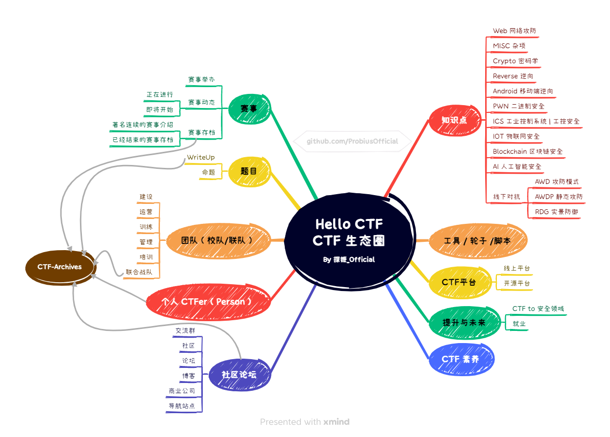

## About Me
```
你好啊，我叫探姬，ID @ Probius / ProbiusOfficial
```

- CTFer | CTF Author| Security Researcher | Developer | Vtuber
- Leader of [Hello CTF](https://github.com/ProbiusOfficial/CTF-QuickStart)
- 网络空间安全专业 | Major in CyberSecurity
- 星际玩家 钻石组 Rank *107* MMR *3498* 忠诚的RTS玩家x | RTS Player
- “愿你如世界美好一般，永远闪耀” | "May you, the beauty of this world, always shine."    
- Twitter@[ProbiusOfficial](https://twitter.com/ProbiusOfficial) 
- Vtuber@[Bilibili](https://space.bilibili.com/27109929) 

## My Projects
```
因为热爱，所以长久。
```
### 🏴 CTF

**Main_Project : [Hello-CTF](https://github.com/ProbiusOfficial/Hello-CTF)**

**Related_Project :**

- [ctf-docker-template](https://github.com/CTF-Archives/ctf-docker-template)
- [Hello_CTF-Shell](https://github.com/ProbiusOfficial/Hello_CTF-Shell)
- [CTFtools-wiki](https://github.com/ProbiusOfficial/CTFtools-wiki) 
- [CTF-OS](https://github.com/ProbiusOfficial/CTF-OS) 
- [CTFtime](https://github.com/ProbiusOfficial/CTFtime) 
- [helloCTF-CTFerlink](https://github.com/ProbiusOfficial/helloCTF-CTFerlink) 
- [Awsome-Sec.CTF-Videomaker](https://github.com/ProbiusOfficial/Awsome-Sec.CTF-Videomaker) 
- [PHPSerialize-labs](https://github.com/ProbiusOfficial/PHPSerialize-labs)
- [Invitation-generating](https://github.com/ProbiusOfficial/Invitation-generating)



### ⚔ Security

- [SecToolKit | 安全工具合集](https://github.com/ProbiusOfficial/SecToolKit)

- [Cybersecurity-StartGuide | 网络安全入门指南](https://github.com/ProbiusOfficial/Cybersecurity-StartGuide)
- [PhishingBook | 钓鱼攻击资源汇总&备忘录](https://github.com/tib36/PhishingBook)
- [bashFuck | Bash无字母命令执行](https://github.com/ProbiusOfficial/bashFuck)

## My Team
- [CTF-Archives](https://github.com/CTF-Archives)
```
一个致力于在中国大陆范围内整合赛事题目、复现Docker环境的组织，一切皆了更好的、更开放的CTF学习环境。
```
- [Web3-Club](https://github.com/Web3-Club)

```
独立自由公益的Web3开源社区 始终致力于 Web3相关中文知识的传播建设与发展。
```

 
